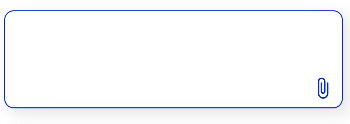
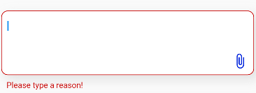

## Usage

```dart
class MyHomePage extends StatefulWidget {
  const MyHomePage({Key? key, required this.title}) : super(key: key);
  final String title;

  @override
  State<MyHomePage> createState() => _MyHomePageState();
}

class _MyHomePageState extends State<MyHomePage> {
  final myTextController = TextEditingController();
  var reasonValidation = true;
  final GlobalKey<FormState> formKey = GlobalKey<FormState>();

  @override
  void initState() {
    super.initState();
    myTextController.addListener(() {
      setState(() {
        reasonValidation = myTextController.text.isEmpty;
      });
    });
  }

  @override
  Widget build(BuildContext context) {
    return Scaffold(
      appBar: AppBar(
        title: Text(widget.title),
      ),
      body: Center(
        child: Padding(
          padding: const EdgeInsets.all(8.0),
          child: Column(
            mainAxisAlignment: MainAxisAlignment.center,
            children: <Widget>[
              Form(
                key: formKey,
                child: TextArea(
                  borderRadius: 10,
                  borderColor: const Color(0xFFCFD6FF),
                  textEditingController: myTextController,
                  suffixIcon: Icons.attach_file_rounded,
                  onSuffixIconPressed: () => {},
                  validation: reasonValidation,
                  errorText: 'Please type a reason!',
                ),
              ),
            ],
          ),
        ),
      ),
      floatingActionButton: FloatingActionButton(
        onPressed: () => {
          if (formKey.currentState!.validate())
            {}
        },
        tooltip: 'Increment',
        child: const Icon(Icons.add),
      ),
    );
  }
}
```
